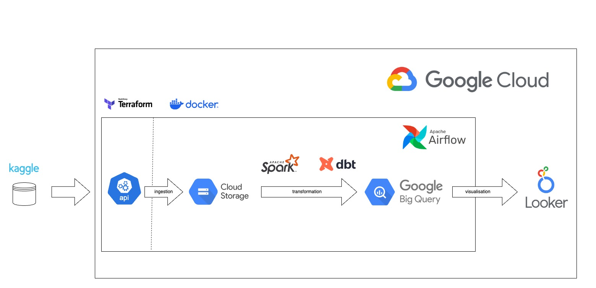
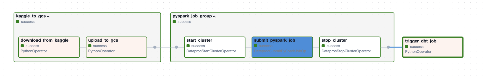
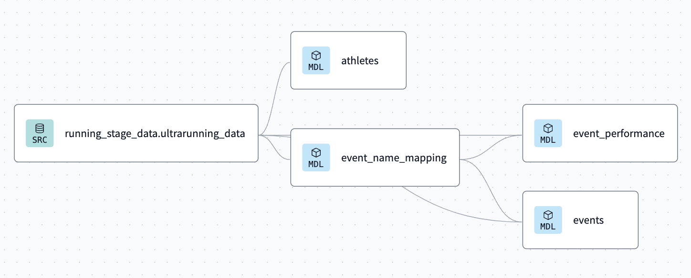
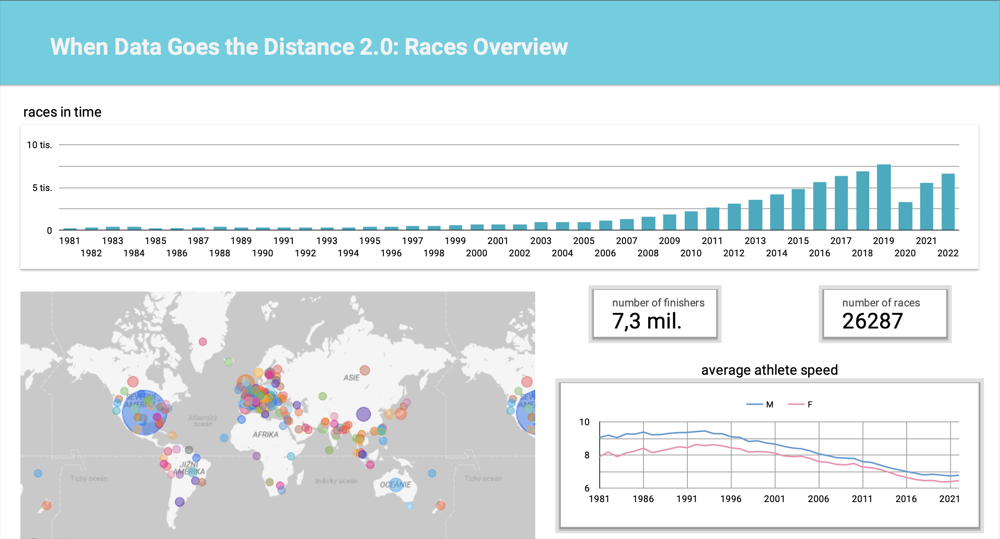
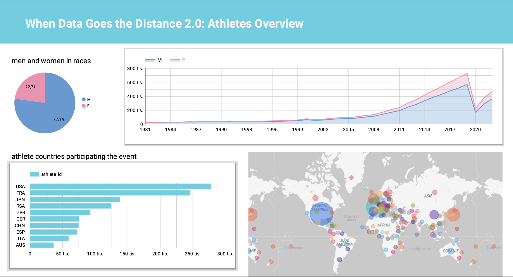

# When Data Goes the Distance 2.0

The project When Data Goes the Distance 2.0 started as part of a Data Engineering Zoomcamp course. It looks into Kaggle dataset about ultrarunning races and athletes, going back to 1798. This project builds on my earlier work where I used tools like PySpark, pandas, and matplotlib for analysing the same dataset. This time, I'm focusing on how to store data in a warehouse and process it before any analysis. 

**Spark project with data analysis:** [When Data Goes the Distance](https://github.com/AnzelaMachackova/when-data-goes-the-distance)

### Technology Overview

For this project, the following technologies were used:

- **Google Cloud**: Provides the infrastructure for data storage and processing.
- **BigQuery**: Serves as the data warehouse, facilitating large-scale data analysis.
- **Apache Spark / Dataproc**: Handles the initial data transformations.
- **dbt (data build tool)**: Used for further transformations tailored for analytics.
- **Apache Airflow**: Orchestrates the workflow, automating the data pipeline from ingestion to visualization.
- **Looker**: For visualizing the data and generating insightful reports.

These technologies were chosen not only for their individual capabilities but also for their synergy in creating a robust data engineering pipeline.

### Architecture and Workflow

The architecture of the project is illustrated in the diagram with the following workflow:

1. **Data Ingestion**: Data is pulled from Kaggle via an API and stored in Google Cloud Storage.
2. **Data Transformation**: Apache Spark and dbt are used for data transformation. The choice of these tools was driven by practical considerations—to experience both PySpark jobs on Google Cloud Platform (Dataproc) and integration with dbt.
3. **Visualization**: The processed data is visualized using Looker, showing trends in ultrarunning races since 1981 and providing detailed athlete profiles.

### Implementation

The implementation steps involved:

- **Infrastructure Setup**: Using Terraform to create resources (like data buckets, datasets etc.) and Docker to containerize Airflow.
- **Job Scheduling**: All the steps are scheduled and managed through Airflow, ensuring seamless end-to-end data flow.

- **Data Extraction**: Setting up a DAG in Airflow that pulls data from Kaggle and stores it in Google Cloud Storage.
- **Data Processing**: A PySpark script in Jupyter notebook transforms the data and stores it back on GCS. This script was later adapted to run as a Dataproc job processing data into BigQuery.
- **Data Transformation**: Further transformations are managed through dbt Cloud, where models and scripts are developed to structure the data effectively for reporting.

### Final Looker report
**Races Overview:** The first dashboard provides a detailed analysis of ultrarunning races over time, showing a trend of increasing races annually from 1981 to 2022. It includes a world map highlighting race locations globally, the total number of races and finishers, and a graph of average speeds of male and female athletes over the years.

 

**Athletes Overview:** The second dashboard focuses on the participants, showing the gender distribution in races, with a significant majority being male. It also charts the increase in participation over time for both genders and shows the top countries by athlete participation, with the USA leading significantly.

 
  
### Challenges and Results

This project had many challenges:

- **Learning New Tools**: This was my first time using dbt, and it was great experience.

- **Data Processing**: Managing Dataproc clusters and building a data model wasn’t easy because there was so much different data.

- **Infrastructure Management**: Using Terraform, handling IAM roles and other services taught me a lot about managing cloud systems.
The part I enjoyed least was making the **visual reports in Looker**, but it was important for getting useful results.

### Conclusion and Recommendations

This project was a full exercise in data engineering, from taking in data to making reports. It gave me hands-on experience with several tools and technologies like Dataproc, dbt, Terraform, and Looker. For anyone wanting to learn more about data engineering, I suggest doing something similar: start with a strong base in technology, work with real data, and make sure everything is connected from start to finish.

### Further Enhancements

I could make the data models better for clearer insights and use more advanced features in Looker for deeper exploration of the data. I might also expand the infrastructure to handle bigger data sets or more complex changes.

This project shows how important it is to have real experience in data engineering. It demonstrates that using many tools together can give you important insights and help you understand big data projects better.
